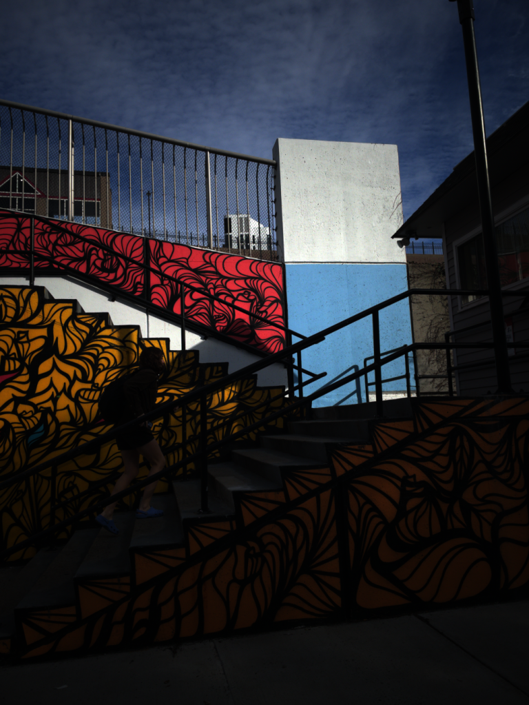
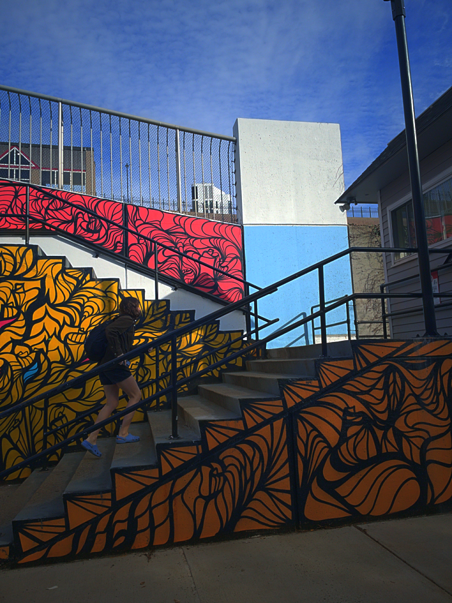
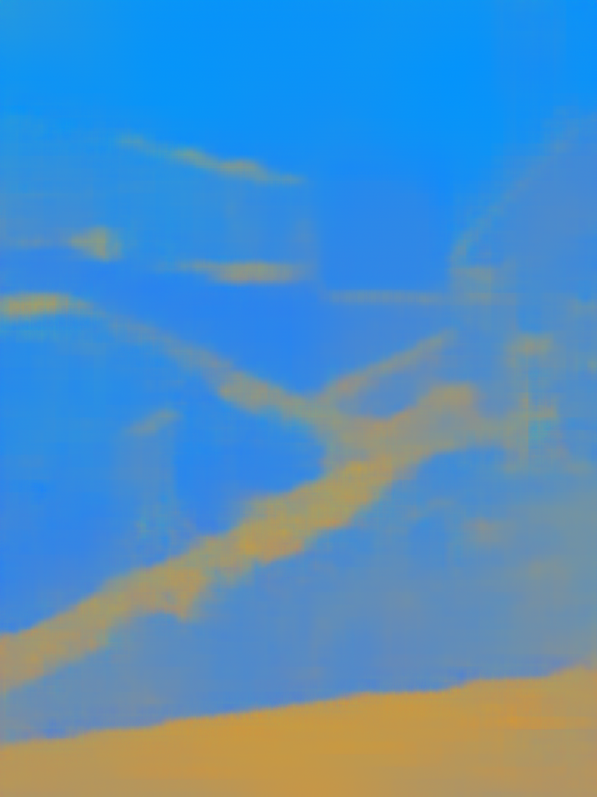
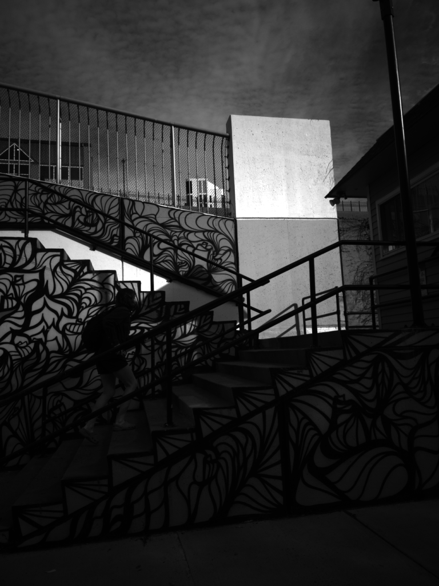
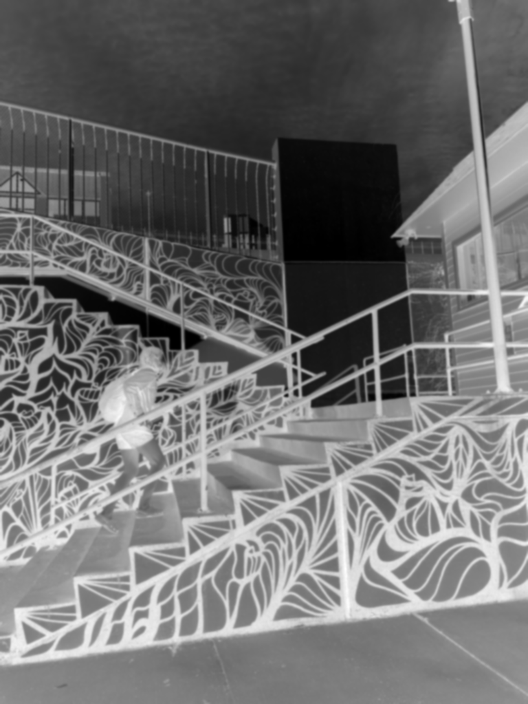

# SR-Retinex

SR-Retinex is a Retinex-based illumination equalization pipeline for 16-bit linear RGB images that combines classical illumination estimation with learned spectral-ratio (ISD) maps.

The method estimates a scalar illumination field using Recursive Retinex and applies a color-consistent correction in log-RGB space by shifting pixels along predicted illumination directions. This allows illumination changes (e.g., shadows) to be adjusted without introducing hue shifts.

The Vision Transformer model predicts per-pixel illumination direction maps used to guide the correction.

## Setup

Use either Conda:

```bash
conda env create -f environment.yml
conda activate sr-retinex
```

Or `venv`:

```bash
python3.10 -m venv .venv
source .venv/bin/activate
pip install -r requirements.txt
```

## Run

Process a single image:

```bash
python src/retinex2_corrected.py \
  --input data/submission_images/tang_yilin_033.tif \
  --output_dir retinex2_output \
  --beta 100 \
  --max_abs_alpha 0.9 \
  --gamma 6.2 \
  --use_model
```

Process all `.tif` images in a directory:

```bash
bash run.sh
```

Custom input and output directories:

```bash
bash run.sh data/submission_images retinex2_output
```

## Example Results

Each processed image gets its own folder under `retinex2_output/` with display-ready PNGs. The example below is copied into `docs/readme_assets/` so it stays visible in the repository.

### `sankaranarayanan_ravishankar_025`

| Original linear | Equalized linear |
| --- | --- |
|  |  |

| Predicted ISD map | Illumination L | Alpha |
| --- | --- | --- |
|  |  |  |

## Outputs

Results are written under `retinex2_output/<image_id>/`. A typical folder contains:

```text
retinex2_output/<image_id>/
  original_linear.png
  result_equalized.png
  original_srgb.png
  result_equalized_srgb.png
  isd_map_scaled.png
  alpha.png
  illumination_L.png
  reflectance_rgb.png
  angular_error_deg.png
```

- `original_linear.png` and `result_equalized.png` are the linear-space views of the input and corrected result.
- `original_srgb.png` and `result_equalized_srgb.png` are gamma-encoded renderings for easier viewing outside the pipeline.
- `isd_map_scaled.png` visualizes the predicted illumination-shift direction map.
- `illumination_L.png` shows the estimated illumination intensity.
- `alpha.png` shows the per-pixel correction strength.
- `reflectance_rgb.png` shows the Retinex-estimated reflectance component.

The plotting script can be run after a batch run:

```bash
python src/plot_metrics.py
```

## Notes

- The default model path is `model/vit_12_linear.pth`.
- `--use_model` uses the ViT-based ISD estimator.
- All Python source files live directly under `src/`.
